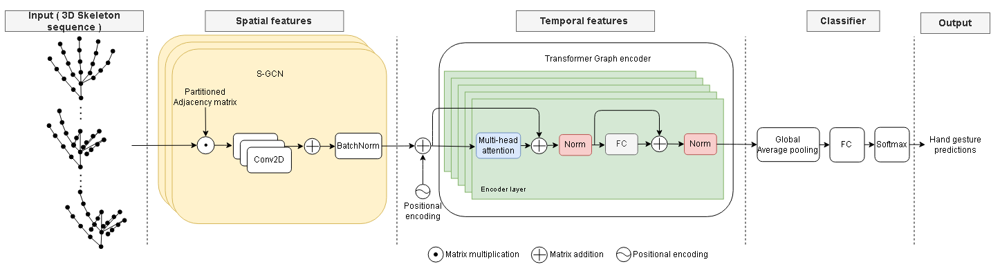

## CoSTr-GCN: Continual Dual Spatial Graph Convolutional Network and Transformer Graph Encoder for online 3D Hand Gesture Recognition


This repository holds the Pytorch implementation of CoSTr-GCN: Continual Dual Spatial Graph Convolutional Network and Transformer Graph Encoder for online 3D Hand Gesture Recognition by Anonymous.

## Introduction

we propose a new deep learning architecture for online hand gesture recognition using 3D hand skeleton data and we call CoSTr-GCN. We build on our previous work STr-GCN which is an offline hand gesture recognition method and we evolve it into an online method. STr-GCN decouples the spatial and temporal learning of the gesture by leveraging Graph Convolutional Networks (GCN) and Transformers. The key idea is to combine two powerful networks: a Spatial Graph Convolutional Network unit that understands intra-frame interactions to extract powerful features from different hand joints and a Transformer Graph Encoder which is based on a Temporal Self-Attention module to incorporate inter-frame correlations. Our method performs well in an offline setting with segmented gestures but it would produce considerable computational redundancy when used in an online setting. We evolved our STr-GCN and transform it into a continual version with a sliding window approach. The code for training our approach is provided in this repository. Training is possible on the [SHREC’21 online track dataset](https://univr-vips.github.io/Shrec21/)
<!-- <p align="center"></p>

<p align="center"></p> -->

### Prerequisites

This package has the following requirements:

* `Python 3.9`
* `Pytorch v1.11.0`

### Training
1. Download the [SHREC’21 online track dataset](https://univr-vips.github.io/Shrec21/). <br/>
2. Extract the 'SHREC21.zip' file and place the extracted folder 'SHREC21' into the data folder ( if it doesn't exist create a folder in the root directory and name it data) in the root directory

2. Set the path for saving your trained models in the  ```train.py (line 148) ```.

3. The dataset used for training is set by default to ```SHREC21```, if you want to test the model on other datasets, add the data loading logic in the data_loaders folder.

4. Run the following command to train the model.
```
python train.py     
```
### Evaluation
1- Download the weights of our [best pre-trained models](https://drive.google.com/drive/folders/11XKDu0uColyt6gnLFvpjQaZFxZzgGyD_?usp=sharing)
2- Change the path of the model used for evaluation in ```test_online.py (line 160) ```
3- Run this command ```python test_online.py```
<!-- ### Citation
If you find this code useful in your research, please consider citing:
```

``` -->
## Acknowledgement

Part of our code was inspired by the  [The ST-GCN implementation](https://github.com/yysijie/st-gcn) and [pytorch implementation of Transformer](http://nlp.seas.harvard.edu/2018/04/03/attention.html) and the [Continual Transformers implementation](https://github.com/LukasHedegaard/continual-transformers). We thank to the authors for releasing their codes.